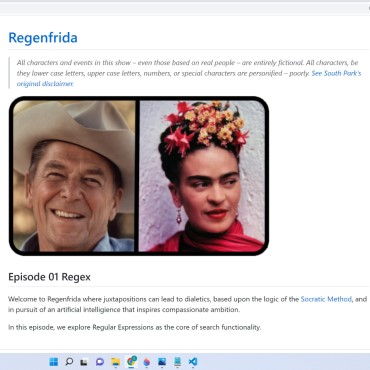
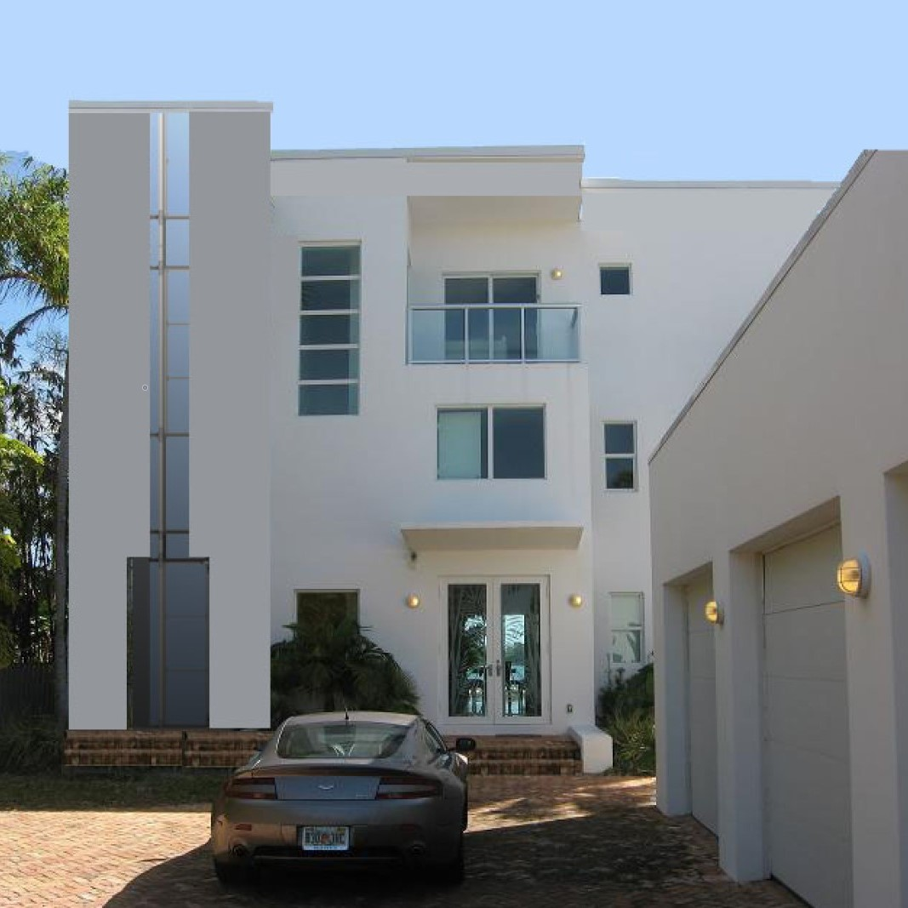

# Getting Started with Create React App

This project was bootstrapped with [Create React App](https://github.com/facebook/create-react-app).

## Available Scripts

In the project directory, you can run:

### `npm start`

Runs the app in the development mode.\
Open [http://localhost:3000](http://localhost:3000) to view it in your browser.

The page will reload when you make changes.\
You may also see any lint errors in the console.

### `npm test`

Launches the test runner in the interactive watch mode.\
See the section about [running tests](https://facebook.github.io/create-react-app/docs/running-tests) for more information.

### `npm run build`

Builds the app for production to the `build` folder.\
It correctly bundles React in production mode and optimizes the build for the best performance.

The build is minified and the filenames include the hashes.\
Your app is ready to be deployed!

See the section about [deployment](https://facebook.github.io/create-react-app/docs/deployment) for more information.

### `npm run eject`

**Note: this is a one-way operation. Once you `eject`, you can't go back!**

If you aren't satisfied with the build tool and configuration choices, you can `eject` at any time. This command will remove the single build dependency from your project.

Instead, it will copy all the configuration files and the transitive dependencies (webpack, Babel, ESLint, etc) right into your project so you have full control over them. All of the commands except `eject` will still work, but they will point to the copied scripts so you can tweak them. At this point you're on your own.

You don't have to ever use `eject`. The curated feature set is suitable for small and middle deployments, and you shouldn't feel obligated to use this feature. However we understand that this tool wouldn't be useful if you couldn't customize it when you are ready for it.

## Learn More

You can learn more in the [Create React App documentation](https://facebook.github.io/create-react-app/docs/getting-started).

To learn React, check out the [React documentation](https://reactjs.org/).

### Code Splitting

This section has moved here: [https://facebook.github.io/create-react-app/docs/code-splitting](https://facebook.github.io/create-react-app/docs/code-splitting)

### Analyzing the Bundle Size

This section has moved here: [https://facebook.github.io/create-react-app/docs/analyzing-the-bundle-size](https://facebook.github.io/create-react-app/docs/analyzing-the-bundle-size)

### Making a Progressive Web App

This section has moved here: [https://facebook.github.io/create-react-app/docs/making-a-progressive-web-app](https://facebook.github.io/create-react-app/docs/making-a-progressive-web-app)

### Advanced Configuration

This section has moved here: [https://facebook.github.io/create-react-app/docs/advanced-configuration](https://facebook.github.io/create-react-app/docs/advanced-configuration)

### Deployment

This section has moved here: [https://facebook.github.io/create-react-app/docs/deployment](https://facebook.github.io/create-react-app/docs/deployment)

### `npm run build` fails to minify

This section has moved here: [https://facebook.github.io/create-react-app/docs/troubleshooting#npm-run-build-fails-to-minify](https://facebook.github.io/create-react-app/docs/troubleshooting#npm-run-build-fails-to-minify)

# [lewis-port](https://digital.ncdcr.gov/digital/collection/p15012coll1/id/59370/)
### Here are early intern projects "Bein Green"!

## Overview
Lewis-port, short for ChristiLewis' portfolio, is a REACT native SPA, or single Page Application.  Lightweight and easy to modify.  

## Contents
  * [Overview](#overview),
  * [Table of Contents](#contents),
  * [Description](#description),
  * [Installation](#installation),
  * [Notes](#notes),
  * [Usage](#usage),
  * [Credits](#credits),
  * [License](#license),
  * [Badges](#badges),
  * [Features](#features),
  * [Contribute](#contribute),
  * [Tests](#tests)

  ## Description
  * The grand finale portfolio.  Less than I was expecting from myself, but more than I could have ever imagined just a year ago!
  * All examples of work I have worked on personally in a detailed manner.  The approach I have taken to this course is one used for millenia in the study of art and architecture.  First, treat it as a craft and try to study, analyze, draw and re-draw examples of works you admire. 
  * I used the opportunity of making a portfolio to categorize both works in architecture and development.  Right now it is messy, as all things are in the beginning.
  * The best aspect of the code presented  is that it demonstrates the awkward tension between uniting the two worlds.
  * Phygital is a term coined by Chris Weil in 2007, "The term phygital (synaeresis between the words “physical” and “digital”) was coined in 2007 by Chris Weil, currently Chairman-CEO at Momentum Worldwide, an international practice in the fields of consulting, strategy, analytics, and experience design," [Phygital Transformation article](https://onlinelibrary.wiley.com/pb-assets/assets/14679310/R&DM%20-%20CFP%20Phygital%20Transformation.pdf)

  ## Installation
* As REACT application, there is no special installation required for the general us of the lewis-port app. This is the last element of the MERN stack.  It is part 20 of 22 modules and 40 overall projects performed over a six month odyssey of the full-stack bootcamp sponsored by the University of Miami. 

## Usage

**Criteria from the Module 20 Challenge:**
>GIVEN a single-page application portfolio for a web developer
WHEN I load the portfolio
THEN I am presented with a page containing a header, a section for content, and a footer
WHEN I view the header
THEN I am presented with the developer's name and navigation with titles corresponding to different sections of the portfolio
WHEN I view the navigation titles
THEN I am presented with the titles About Me, Portfolio, Contact, and Resume, and the title corresponding to the current section is highlighted
WHEN I click on a navigation title
THEN I am presented with the corresponding section below the navigation without the page reloading and that title is highlighted
WHEN I load the portfolio the first time
THEN the About Me title and section are selected by default
WHEN I am presented with the About Me section
THEN I see a recent photo or avatar of the developer and a short bio about them
WHEN I am presented with the Portfolio section
THEN I see titled images of six of the developer’s applications with links to both the deployed applications and the corresponding GitHub repository
WHEN I am presented with the Contact section
THEN I see a contact form with fields for a name, an email address, and a message
WHEN I move my cursor out of one of the form fields without entering text
THEN I receive a notification that this field is required
WHEN I enter text into the email address field
THEN I receive a notification if I have entered an invalid email address
WHEN I am presented with the Resume section
THEN I see a link to a downloadable resume and a list of the developer’s proficiencies
WHEN I view the footer
THEN I am presented with text or icon links to the developer’s GitHub and LinkedIn profiles, and their profile on a third platform (Stack Overflow, Twitter) 
>

  * 
  * 

  * [GitHub Repo](https://github.com/ChristiLewis/lewis-port)

    ## Credits
  * [UM Coding Bootcamp](https://bootcamp.miami.edu/coding/)
  * [ChristiLewis](https://github.com/ChristiLewis)

## License
* Contents are credited as inspired by the bootcamp, API documentation licensing requirements, and as per permission by the team members mentioned above. All content by the UM Bootcamp has a MIT License.

## Badges
* There are no badges generated at this time. For more information: [shields.io](https://shields.io/)

## Features
* Full M-E-R-N stack application

## How-to-Contribute
* Any recommendations?  Please see [contributorCovenant](https://www.contributor-covenant.org)

## Tests
* This is a Jest TTD based project still under development.
  